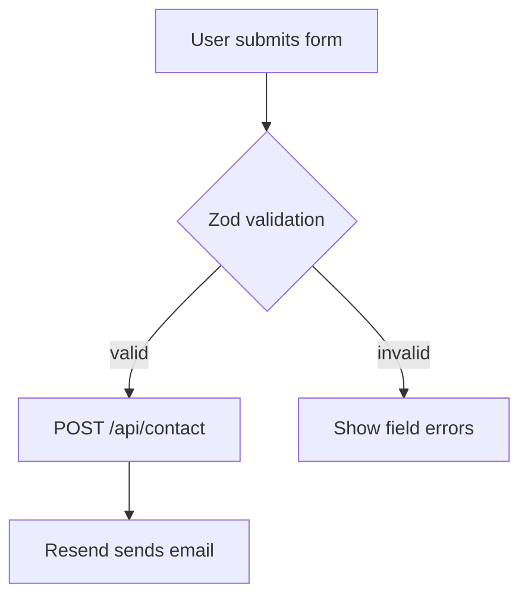

# StudioSC Portfolio — Claude Code Guide

## Project Summary

StudioSC is a duo software studio (Seth builds, Christine breaks). This portfolio is the public face: project case studies, a technical/non-technical blog, and a contact form. It is a static-first Next.js site — no database, no auth, content lives in MDX files committed to git.

**Live site:** https://studiosc.dev

---

## Tech Stack

| Layer     | Technology                                  |
| --------- | ------------------------------------------- |
| Framework | Next.js 16 (App Router)                     |
| Language  | TypeScript 5                                |
| Styling   | Tailwind CSS v4 + `@tailwindcss/typography` |
| Content   | MDX via `next-mdx-remote` + `gray-matter`   |
| Animation | Framer Motion                               |
| Forms     | React Hook Form + Zod                       |
| Email     | Resend + React Email                        |
| Analytics | Plausible (optional, dormant)               |
| Testing   | Playwright (E2E, 5 browsers)                |
| CI        | GitHub Actions                              |
| Hosting   | Vercel (auto-deploy on push to `main`)      |

---

## Directory Map

```
app/                  Next.js App Router pages
  api/contact/        Contact form POST handler (Resend)
  blog/[slug]/        Individual blog post pages
  work/[slug]/        Individual project pages
components/
  layout/             Header, Footer
  home/               Hero, ProjectCard, LatestBlogPosts
  blog/               BlogCard, BlogList, SocialPost
  about/              PersonSection, SharedInterests
  contact/            ContactForm, ContactHeader
  ui/                 Shared primitives (LinkedInIcon, etc.)
content/
  blog/               MDX blog posts
  projects/           MDX project case studies
lib/
  mdx.ts              gray-matter file reader + post helpers
  email.tsx           React Email contact template
  utils.ts            cn() helper, reading-time calc
types/index.ts        BlogPost, Project, Contact, Person interfaces
e2e/                  Playwright test files
public/
  resumes/            seth-cv.pdf, christine-cv.pdf
```

---

## Content Schemas

### Blog post frontmatter (`content/blog/*.mdx`)

```yaml
title: string
description: string
date: "YYYY-MM-DD"
author: string          # defaults to "StudioSC"
category: "technical" | "non-technical"
projectSlug: string     # optional — links to a project page
```

### Project frontmatter (`content/projects/*.mdx`)

```yaml
title: string
description: string
date: "YYYY-MM-DD"
tags: string[]
thumbnail: string # Cloudinary URL (2:1 ratio recommended)
githubUrl: string # optional
liveUrl: string # optional
underDevelopment: true # optional flag — shows "In Development" badge
qaInProgress: true # optional flag — shows "QA In Progress" badge
```

### Technical diagrams — Mermaid

Add a diagram to any blog post or project page with a **fenced `mermaid` code block** — no image uploads needed:

````mdx

````

> **Important — use the fenced code block above, NOT `<Mermaid chart={`...`} />`.**
> `next-mdx-remote/rsc` strips MDX expressions (`{...}`), so the `chart={...}`
> prop never reaches the component. The `pre` mapping in `app/blog/[slug]/page.tsx`
> and `app/work/[slug]/page.tsx` detects `language-mermaid` code blocks and renders
> them via `components/blog/Mermaid.tsx`. Tip: quote node labels that contain spaces
> or punctuation, e.g. `A["First-party OAuth · PKCE"]`.

Supported diagram types: flowchart, sequenceDiagram, erDiagram, classDiagram, stateDiagram, gantt, pie, gitGraph.
See [mermaid.js.org](https://mermaid.js.org/intro/) for full syntax reference.

Rendered with dark theme to match the site. Available in both `/blog/[slug]` and `/work/[slug]` pages.

### Non-technical blog post pattern

Non-technical posts use the `<SocialPost />` component to embed existing Instagram/Facebook posts. Workflow:

1. Copy the post caption into the MDX body as prose
2. Add `<SocialPost platform="instagram" url="https://..." />` for the embed
3. Set `category: "non-technical"` in frontmatter

---

## Key Commands

```bash
npm run dev           # local dev server (http://localhost:3000)
npm run build         # production build
npm run lint          # ESLint
npm run type-check    # tsc --noEmit
npm run format        # Prettier (write)
npm run test:e2e      # Playwright headless
npm run test:e2e:ui   # Playwright interactive UI
```

---

## Cloud Services Registry

| Service                                   | Purpose                                                           | Auth                                                                                  | Notes                                                                                                                                                                                                                                                                                                                |
| ----------------------------------------- | ----------------------------------------------------------------- | ------------------------------------------------------------------------------------- | -------------------------------------------------------------------------------------------------------------------------------------------------------------------------------------------------------------------------------------------------------------------------------------------------------------------- |
| **Vercel**                                | Hosting & deployment                                              | GitHub OAuth + `VERCEL_TOKEN`                                                         | **Production branch is `main`, always.** Production deploys are CI-gated (see below) — Vercel's automatic Git deploys for `main` should be disabled in the project's Git settings to avoid double-deploys. Preview deploys on other branches/PRs still use Vercel's native Git integration. No `vercel.json` needed. |
| **Resend**                                | Contact form email → `hello@studiosc.dev`                         | `RESEND_API_KEY`                                                                      | Set in `.env.local` and in Vercel env vars. Required for contact form. Also add as a GitHub Actions secret.                                                                                                                                                                                                          |
| **Cloudinary**                            | Image hosting for project thumbnails and blog media               | URL-based (no auth needed for reads)                                                  | Account: `dg0t8ipwi`. Upload new images to Cloudinary and use the CDN URL in MDX.                                                                                                                                                                                                                                    |
| **Plausible Analytics**                   | Site traffic analytics                                            | `NEXT_PUBLIC_PLAUSIBLE_DOMAIN` env var                                                | **Currently disabled.** To enable: set `NEXT_PUBLIC_PLAUSIBLE_DOMAIN=studiosc.dev` in the Vercel dashboard. No code changes needed.                                                                                                                                                                                  |
| **Vercel Web Analytics / Speed Insights** | Traffic + performance metrics                                     | None (auto via `@vercel/analytics`, `@vercel/speed-insights`)                         | Wired up in `app/layout.tsx`. Enable in the Vercel dashboard's Analytics tab to start collecting data — no further code changes needed.                                                                                                                                                                              |
| **GitHub Actions**                        | CI: lint, type-check, build, E2E tests, **and production deploy** | `RESEND_API_KEY`, `VERCEL_TOKEN`, `VERCEL_ORG_ID`, `VERCEL_PROJECT_ID` GitHub secrets | Runs on push/PR to `main` and `develop`. The `deploy` job runs only on push to `main`, after lint/type-check/test/build all pass, and deploys to Vercel production via the Vercel CLI.                                                                                                                               |

### Required environment variables

```bash
# .env.local (never commit)
RESEND_API_KEY=re_...         # required — contact form

# Optional (Vercel dashboard)
NEXT_PUBLIC_SITE_URL=https://studiosc.dev
NEXT_PUBLIC_PLAUSIBLE_DOMAIN=studiosc.dev   # enables analytics
```

### GitHub Actions secrets (required for CI-gated production deploys)

```bash
RESEND_API_KEY       # same value as the Vercel env var
VERCEL_TOKEN         # personal/team token, generate at vercel.com/account/tokens
VERCEL_ORG_ID        # from `npx vercel link` -> .vercel/project.json
VERCEL_PROJECT_ID    # from `npx vercel link` -> .vercel/project.json
```

---

## Handoff Protocol

At the end of every Claude Code session, create or overwrite `HANDOFF.md` in the project root with:

- **What changed** — files edited/created
- **Why** — context behind the changes
- **Status** — complete / in-progress
- **Next steps** — actionable TODOs

`HANDOFF.md` is ephemeral — it gets overwritten each session so it always reflects the current state. Read it at the start of every session.
