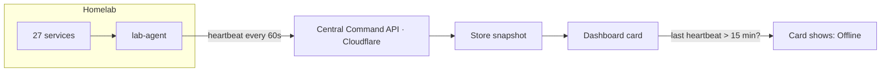

# Who Watches the Watchman? Connecting the Homelab to Central Command

## The Setup

We run a homelab: a small, dedicated computer sitting at home that runs about 27 apps around the clock. It handles things like media streaming, photo backups, a password vault, document scanning, ad blocking, and quite a bit more. Everything is self-hosted, everything runs on hardware we own, and the monthly cost is zero.

The lab already monitors itself. A tool called Uptime Kuma checks every service every few minutes and reports whether each one is healthy. If something goes down, another tool called ntfy sends an alert straight to the phone. Sounds solid, right?

Here's the catch: the alarm system lives in the same building it's protecting.

## The Problem

Think about a smoke detector wired into the same circuit as the stove. If the breaker trips, the detector goes dark at exactly the moment you need it most.

That's the homelab's blind spot. If the machine loses power, if Docker crashes, if the network drops, every monitoring tool goes down with it. No alerts fire because the thing that sends alerts is dead too. And the scary part is that silence looks identical to "everything is fine." There's no way to tell the difference from the outside.

We already had a project running in the cloud that could help: [Central Command](/work/central-command), a personal dashboard that pulls together data from calendars, weather, fitness trackers, and more. It runs on Cloudflare's edge network, so it stays online regardless of what happens at home. If anything could watch the watchman, it was this.

## The Idea

The first instinct might be to have the cloud reach into the homelab and check on it. But that means opening a door from the internet into the home network, which is a security problem we didn't want to create.

So we flipped it. The homelab reaches out instead. A small program called `lab-agent` runs inside the lab and sends a "heartbeat" to Central Command every 60 seconds. Each heartbeat carries a snapshot: which services are up, which are down, and whether the latest backups succeeded. Central Command stores the snapshot and displays a summary card on the dashboard.

But the real trick isn't reading the data. It's watching the clock.

If the last heartbeat is more than 15 minutes old, the card flips to an "offline" warning. No heartbeat arrived, so something must be wrong. **Silence stops meaning "all clear" and starts meaning "something's wrong."** That one shift is the entire point of the integration.

## Design Decisions

A few choices shaped how this works, and each one traces back to a constraint we cared about.

**Push, don't pull.** The lab talks to the cloud. The cloud never reaches back in. No ports opened on the home network, no tunnels to maintain, no extra attack surface. The homelab initiates every connection, just like a browser loading a webpage.

**Labels, not addresses.** Central Command is a portfolio piece with a public demo. Visitors can see the dashboard. That means the homelab card can show service names ("Jellyfin," "Vaultwarden"), but never hostnames, IP addresses, or anything that reveals the network's layout. Demo visitors see entirely fictional data, isolated at the server level.

**Free tier everything.** Central Command runs on Cloudflare's free Workers plan. The homelab runs on hardware we already own. Cloud-side push notifications go through ntfy.sh's free public service. Total ongoing cost: zero.

**The 24/7 unlock.** This integration only became practical after a recent hardware change. The homelab used to run on a Windows desktop that got shut down every evening. A system that sleeps eight hours a night would have triggered a false "offline" alarm every single day, training us to ignore the warning entirely. Moving to a dedicated, always-on Linux mini PC is what made the staleness check meaningful. If "offline" means "actually offline," you pay attention.

## What's Next

Two features are on the roadmap. First: forwarding real-time alerts from the homelab's own notification system into Central Command, so service outages and backup failures show up on the dashboard the moment they happen, not just at the next heartbeat.

Second, and more interesting: a dead-man's switch. If Central Command hasn't received a heartbeat in too long, it will send a push notification to the phone through an external cloud service, bypassing the homelab entirely. The homelab's own alert tools won't be involved at all. That's the final piece: making sure that when things go quiet, someone notices.
