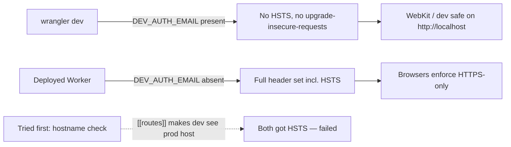
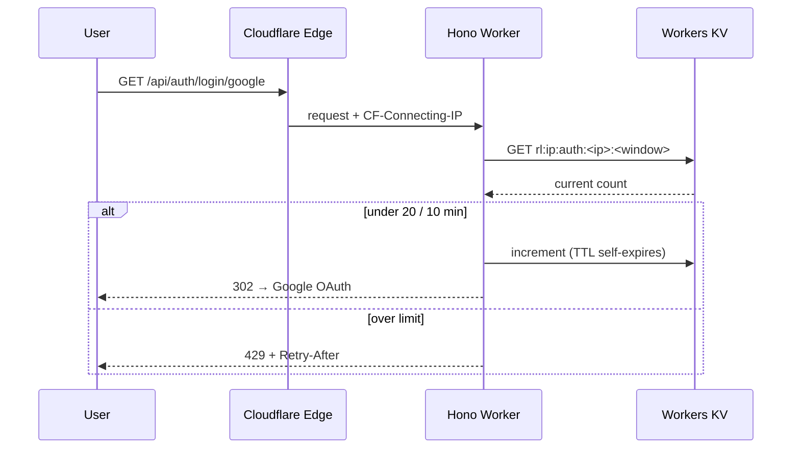

# Carrying the Hardening Over: Security Pass on Central Command

## Project Overview

In the [last post](/blog/portfolio-security-hardening) we hardened the StudioSC portfolio — a static-first Next.js site on Vercel. This is the promised follow-up: the same security pass on **Central Command**, a personal performance dashboard built on an entirely different stack. Cloudflare Workers (Hono + Drizzle on D1) for the API, a React/Vite SPA on Cloudflare Pages, pnpm + Turborepo for the monorepo.

That stack difference is the whole story here. The _goals_ port over cleanly; almost none of the _implementation_ does. A `next.config.ts` `headers()` block, `process.env.NODE_ENV`, an Upstash Redis limiter, a contact-form honeypot — every one of those assumes a Next.js-on-Vercel world that Central Command doesn't live in. So this was an **audit-and-adapt** pass, not a copy-paste.

## Scope

- Clear out `pnpm audit` vulnerabilities
- Add standard security headers and a Content Security Policy (CSP) — across _two_ surfaces, not one
- Protect the only unauthenticated endpoints from scripted abuse
- Keep everything on the Cloudflare free tier, with no new runtime dependencies

## Dependency Cleanup

Where the portfolio had 19 local advisories (60 via Dependabot), Central Command's newer, leaner tree had just **two** — but one of them mattered:

- **`drizzle-orm` (high)** — SQL injection via improperly escaped SQL identifiers ([GHSA-gpj5-g38j-94v9](https://github.com/advisories/GHSA-gpj5-g38j-94v9)). Fixed by bumping `^0.44.2` → `^0.45.2`.
- **`esbuild` (moderate)** — the dev-server SSRF issue ([GHSA-67mh-4wv8-2f99](https://github.com/advisories/GHSA-67mh-4wv8-2f99)), nested three deep under `drizzle-kit`'s deprecated `@esbuild-kit/*` chain.

The esbuild one is the more interesting fix. The usual advice — "upgrade the parent" — doesn't work: even the _latest_ `drizzle-kit` still pulls `@esbuild-kit/esm-loader`, which still nests a vulnerable `esbuild`. So the patched version has to be forced directly. On the portfolio (npm) that was a flat `overrides` entry. Here it's a pnpm override — and a small gotcha worth noting: **pnpm 11.5 stopped reading the `pnpm.overrides` field in `package.json`** and moved it to `pnpm-workspace.yaml`:

```yaml
# pnpm-workspace.yaml
overrides:
  esbuild: ">=0.25.4"
```

That deduped every nested copy to the patched line. Dev-only tooling — it never ships to the Worker — but a clean audit is a clean audit.

Result: **No known vulnerabilities found**, verified with a full `build` + `typecheck` + `lint` pass afterward. (No Playwright suite here yet — the verification gate is different, more on that below.)

## Security Headers & CSP — Two Surfaces, Not One

The portfolio could set every header in a single `next.config.ts` block because Next.js serves both the pages and the API from one origin. Central Command is split: the **API Worker** serves only JSON, and the **SPA** is static files on Pages. Those are two different runtimes with two different mechanisms, and they want two different policies.

**API Worker** — Hono ships a built-in `secureHeaders` middleware, so no new dependency. Because the API only ever returns JSON or redirects — never HTML — its CSP is locked all the way down:

```
Content-Security-Policy: default-src 'none'; base-uri 'none';
  frame-ancestors 'none'; form-action 'none'; object-src 'none'
```

There are simply no scripts, styles, or images for an API response to load, so nothing legitimate is denied. Plus `X-Frame-Options: DENY`, `nosniff`, `Referrer-Policy: strict-origin-when-cross-origin`, and a `Permissions-Policy` denying camera/microphone/geolocation.

**Web SPA** — the real browser-facing CSP lives in a Cloudflare Pages [`_headers`](https://developers.cloudflare.com/pages/configuration/headers/) file. This is where the allow-list actually has to think:

- `script-src 'self'` — kept strict. The one inline script in the app (a theme bootstrap that sets light/dark before first paint to avoid a flash) was **moved out of `index.html` into a same-origin file**, specifically so the CSP wouldn't need an `'unsafe-inline'` or a brittle hash.
- `img-src 'self' data: https:` — the news pillar renders thumbnails straight from RSS feeds (ESPN, Hacker News, TechCrunch, PCGamesN, Dexerto). Those image hosts are unpredictable and numerous, so `https:` is the honest allow-list for images specifically. Low risk: with `object-src 'none'` and `script-src 'self'`, an image can't execute anything.
- `style-src 'self' 'unsafe-inline'` — React and SVG set styles via element attributes; there's no inline `<style>` or CSS-in-JS to nonce.
- `connect-src 'self'` — the API is same-origin (`/api/*` on the same host; Vite proxies it in dev). No cross-origin fetches at all.
- `frame-ancestors 'none'`, `object-src 'none'`, `base-uri 'self'`, `form-action 'self'`, plus the standard header set.

### The WebKit gotcha — and the twist that broke the obvious fix

The portfolio pass taught us that Safari/WebKit honor `Strict-Transport-Security` and `upgrade-insecure-requests` _even on `localhost`_, rewriting `http://localhost` to `https://` and timing out every WebKit test. The fix there was one line: gate both behind `process.env.NODE_ENV === "production"`.

That line doesn't exist on Workers. There's no `NODE_ENV`. The obvious substitute is to check the request's hostname — `localhost` means dev, the real domain means prod. So that's what I wrote first.

It didn't work, and the reason is a genuinely sharp edge. Central Command's `wrangler.toml` has a `[[routes]]` pattern binding the Worker to `centralcommand.studiosc.dev/api/*`. When you run `wrangler dev`, it **simulates that route** — which means the Worker sees the _production_ hostname locally too. Both my "dev" and "prod" `curl` checks came back with HSTS attached. Hostname detection is structurally blind here.

The signal that _does_ work is one the project already had: `DEV_AUTH_EMAIL`, a variable set only in `.dev.vars` for local auth and never deployed. Its absence reliably identifies a deployed Worker, and it's safe-by-default — a functioning local dev always has it, so HSTS can never leak onto `localhost`.



The SPA side is simpler: a Pages `_headers` file is only served on deployed builds, which are always HTTPS, while the local `vite dev` loop never reads it — so the gotcha can't fire there at all.

Confirmed with `curl -sD -` against `wrangler dev` (no HSTS, no `upgrade-insecure-requests`) versus the production header set (both present), and against `wrangler pages dev` to validate the SPA's full `_headers` set renders correctly.

## Public Endpoints: Rate Limiting, and the Things We _Didn't_ Add

Here's the biggest divergence from the portfolio pass. That site's attack surface was a **contact form** — a public POST to a real inbox — so it got a honeypot field and per-IP rate limiting.

Central Command **has no public forms.** Sign-in isn't a form post; it's a Google OAuth redirect. There's no signup, no contact form, no public webhook. So the honeypot — which exists to catch bots that auto-fill form inputs — would have nothing to guard. It was dropped, deliberately.

What _is_ exposed is the auth group: sign-in start, the OAuth callback, demo entry, logout. These run _before_ any session exists, so the app's normal per-user limits can't see them. The only stable identifier is the caller's IP — and on Cloudflare that's `CF-Connecting-IP`, set by the edge and unspoofable by the client. So those routes sit behind a per-IP limiter: **20 requests / 10 minutes**, returning `429` with a `Retry-After` header.



### KV, not Upstash Redis

The portfolio made its limiter durable across serverless instances with Upstash Redis via the Vercel Marketplace. That's the right call _on Vercel_. On Cloudflare it's the wrong one: Upstash is off-platform, Vercel-oriented, and would be a new external dependency to solve a problem the platform already solves. Workers KV is the native, free-tier equivalent — and Central Command already had a KV-backed rate-limit service for its third-party API budgets, so the per-IP limiter is a fixed-window counter layered onto that existing service. No new dependency, no second vendor.

The honest tradeoff: KV is eventually consistent, so the cap is a _safety ceiling_, not an exact quota — good enough to blunt scripted abuse on a free-tier Worker. If atomic limiting is ever needed, Durable Objects are the documented Phase 2 path.

## Verification

Central Command has no Playwright suite (yet), so the gate is the project's existing pre-commit quality bar plus targeted smoke tests:

```bash
pnpm build && pnpm typecheck && pnpm lint
```

Then, against a running Worker and a local Pages serve:

- `curl`'d the dev Worker and confirmed **no** HSTS / `upgrade-insecure-requests`; confirmed the production branch emits the full set — the dev/prod diff working as designed.
- Served the built SPA through `wrangler pages dev` and confirmed the complete CSP + header set on real responses, with the served `index.html` carrying only external scripts (so `script-src 'self'` breaks nothing).
- Hit `/api/auth/login/google` 23 times from one IP: the first **20 returned `302`**, the rest **`429` with `Retry-After: 571`** — exactly the configured 20-per-10-minute window.

`pnpm audit`: clean.

## Why This Matters

The portfolio post made the case that hardening changes _what happens when someone tries to make your site misbehave_, not what it does day to day. That's still true here. What this pass adds is a second lesson: **security measures don't port across stacks — the goals do.** "Add a CSP, gate HSTS to prod, rate-limit public endpoints" survived the move from Next.js/Vercel to Cloudflare intact. `next.config.ts`, `NODE_ENV`, Upstash, and the honeypot did not. Treating the portfolio's solution as a checklist of _intentions_ rather than a snippet to paste is what turned a `[[routes]]`-shaped footgun and an Upstash-shaped dependency into a couple of clean, platform-native fixes.

## What's Next

Central Command is still Phase 1. As it grows — a production Riot API key, a publicly open demo mode behind Cloudflare Access, higher ingest volume — a few of these "good enough for now" calls graduate: Durable Objects for atomic rate limiting, Cloudflare Queues for scaled background fetches, and a tighter CSP if the news-thumbnail story ever moves to a proxied/cached image path. All documented, none of it premature.
