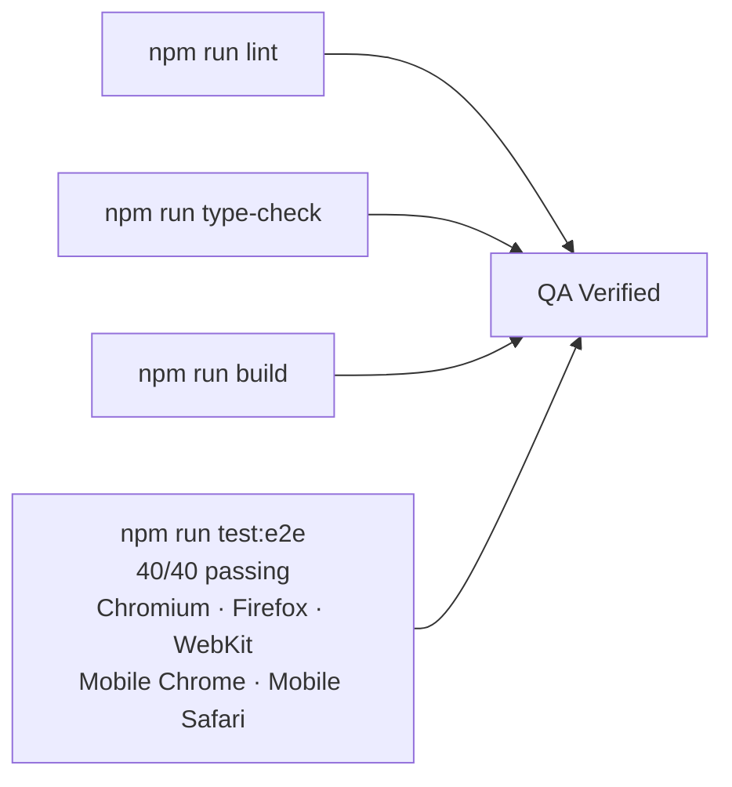

# QA Verified: Closing Out the Test Suite on Our Own Portfolio

## Project Overview

The StudioSC portfolio has been live and growing for a while — new projects, new blog posts, a reworked hero section. What it hadn't had was a fresh look at its own QA status. This post is the case study behind the work that got `/work/portfolio-site` from "QA In Progress" to **QA Verified**.

## Scope

The goal was simple: run the full QA gate we'd want any client project held to, against our own site, and fix whatever it found.

- `npm run lint` — ESLint
- `npm run type-check` — `tsc --noEmit`
- `npm run build` — production build via Turbopack, all routes statically generated
- `npm run test:e2e` — Playwright across **Chromium, Firefox, WebKit, Mobile Chrome, and Mobile Safari**

## What We Found

Lint, type-check, and the build were all clean. The e2e suite wasn't — **12 of 40 tests were failing**. Not because the site was broken, but because the **tests had drifted** from the UI:

- `homepage.spec.ts` was still asserting on copy and buttons from an old hero layout ("Two Pillars, One Mission", "View Engineering Portfolio") that had since been replaced by "The Build" / "The Break" cards and a "View the Studio Showcase" CTA.
- Several tests hit Playwright's **strict-mode** wall — a locator like `getByText("About Us")` or `getByText("Blog")` matched more than one element on the page (a heading _and_ the route announcer, or the header nav link _and_ the footer nav link), which Playwright correctly refuses to resolve ambiguously.
- The "navigate to all pages" test was timing out on **Mobile Chrome and Mobile Safari**, because the desktop nav links it was clicking are `display: none` below the `md` breakpoint.
- A validation-message check for the contact form used a loose regex that matched **both** "Name must be at least 2 characters" and "Company name must be at least 2 characters" — same suffix, different field.
- Firefox and WebKit binaries weren't installed locally, so two of the five browser targets couldn't even launch.

## The Fixes

- **Rewrote `homepage.spec.ts`** to test what's actually on the page today: the h1, the "The Build"/"The Break" cards, and the "View the Studio Showcase" CTA navigating to `/work`.
- **Scoped locators properly** instead of querying the whole page — e.g. `page.locator("header").getByRole("link", { name: "About", exact: true })` so the header nav and footer nav can't collide, and exact-match headings instead of loose text matches.
- **Split the navigation test** into a desktop-viewport case (1280×720, clicking the visible header nav) and a separate mobile-menu test that opens the hamburger menu first. Added a small `id="mobile-menu"` hook to the header component so the mobile nav links are unambiguously targetable.
- **Tightened the contact-form assertion** to an exact string match instead of a regex, so "Name" and "Company name" errors can't be confused.
- **Installed the missing Firefox and WebKit browsers** so the full five-target matrix actually runs.

## Result

All 40 e2e tests pass, across all five browser/device targets. Lint and type-check are clean, and the production build generates all 18 routes without issue. With that, `content/projects/portfolio-site.mdx` flips from `qaInProgress` to `qaVerified: true`, and the badge on `/work` now reflects it.

## Why This Matters

A test suite that's green for the wrong reasons — or quietly skipping browsers — is worse than no suite at all, because it creates false confidence. The fixes here weren't about adding more tests; they were about making the existing ones **actually test the current site**, **fail for real reasons**, and **run everywhere they're supposed to**. That's the bar we hold client projects to, and now it's the bar this site clears too.

## What's Next

With the portfolio itself QA Verified, the next round of work turns to operations: enabling Vercel Web Analytics and Speed Insights, and tightening up the deployment pipeline so promotions to production are less manual.
