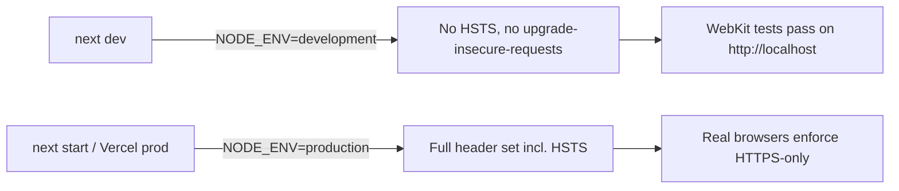
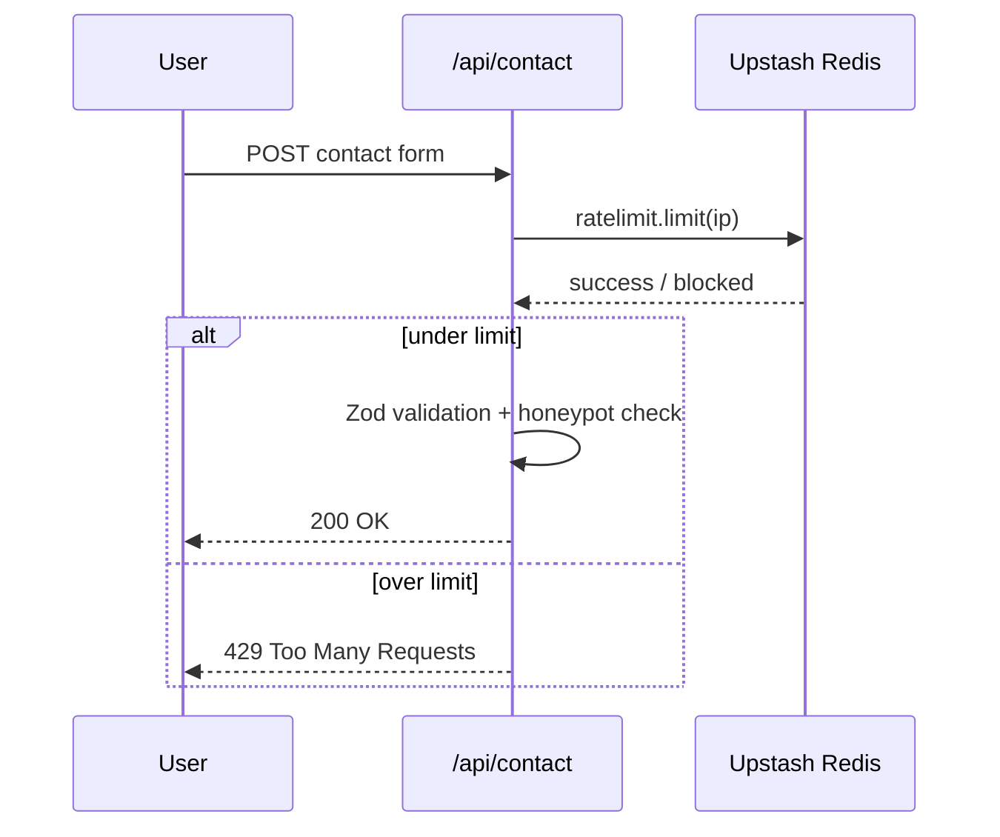

# Hardening Our Own Front Door: Security Pass on the StudioSC Portfolio

## Project Overview

Right after getting the portfolio to **QA Verified** and wiring up automated production deploys, we turned to a question every public-facing site eventually has to answer: what happens when the traffic hitting it isn't a visitor? This post covers the security and abuse-protection pass on `studiosc.dev` — a static-first Next.js site with no database and no auth, but a contact form that talks to a real inbox.

## Scope

- Clear out npm audit / Dependabot vulnerabilities
- Add standard security headers and a Content Security Policy (CSP)
- Protect the contact form from scripted abuse without adding friction for real visitors
- Make the rate limiting durable across serverless instances — within a Vercel **Hobby** plan budget

## Dependency Cleanup

`npm audit` was reporting **19 vulnerabilities locally (60 via GitHub's broader Dependabot scan)**, the bulk of them tracing back to Next.js itself. Upgrading `next` from `16.1.6` → `16.2.9` closed out a batch of critical advisories — HTTP request smuggling, a CSRF bypass, cache poisoning, and an XSS/DoS issue. One nested `postcss@8.4.31` (bundled inside `next`) was still flagged after the upgrade; a flat `overrides` entry in `package.json` deduped it to the patched `8.5.x` line.

Result: **0 vulnerabilities**, verified with a full lint/type-check/build/e2e pass afterward (40/40 Playwright tests across five browsers).

## Security Headers & CSP

Added a `headers()` block in `next.config.ts` applied to every route:

- `Content-Security-Policy` — locks `default-src` to `'self'`, allow-lists Plausible and Vercel's Speed Insights endpoint for `connect-src`, and sets `frame-ancestors 'none'`, `object-src 'none'`, `base-uri 'self'`, `form-action 'self'`.
- `X-Frame-Options: DENY` and `X-Content-Type-Options: nosniff`
- `Referrer-Policy: strict-origin-when-cross-origin`
- `Permissions-Policy` — disables camera, microphone, and geolocation, none of which the site uses
- `Strict-Transport-Security` (HSTS) and the CSP's `upgrade-insecure-requests` directive

### The WebKit gotcha

The last two — HSTS and `upgrade-insecure-requests` — turn out to be the kind of header Safari takes _very_ literally, even on `localhost`. With both enabled unconditionally, **all 8 WebKit and Mobile Safari Playwright tests started failing** with navigation timeouts: Safari was rewriting every `http://localhost:3000` request to `https://`, which doesn't exist in dev.

Fix was straightforward once diagnosed — gate both behind `process.env.NODE_ENV === "production"`:



Confirmed via `curl` against both `next dev` and a production `next start` that the header sets differ as intended, then re-ran the full e2e suite: **40/40 passing** again.

## Contact Form: Rate Limiting + Honeypot

The contact form is the only write path on the site, so it's the realistic target for spam bots. Two layers, both transparent to real visitors:

1. **Honeypot field** — a `website` field, visually hidden (off-screen, `aria-hidden`, `tabIndex={-1}`) and never shown to real users. Bots that auto-fill every input on a form trip it; the API route silently returns a fake "success" without sending an email, so the bot doesn't learn to adapt.

2. **Per-IP rate limiting** — 5 requests per 10 minutes, returning `429 Too Many Requests` once exceeded.

The first cut of the rate limiter was a simple in-memory `Map`, keyed by IP. That's a fine first line of defense, but Vercel serverless functions don't share memory across instances — under any real load, an attacker spread across cold starts could blow well past 5 requests.

### Making it durable: Upstash Redis

We provisioned a free-tier Upstash Redis database through the Vercel Marketplace (Production environment only) and swapped the limiter to `@upstash/ratelimit` + `@upstash/redis`, using a sliding-window algorithm:



`lib/rate-limit.ts` checks for `UPSTASH_REDIS_REST_URL` / `UPSTASH_REDIS_REST_TOKEN` at module load. If they're present (Production), it uses the Redis-backed sliding-window limiter — global across every instance and region. If they're absent (local dev, Preview deploys, which aren't connected to Upstash), it falls back to the original in-memory `Map`. Same `429` contract either way; `route.ts` didn't need to change beyond `await`-ing the now-async call.

## Verification

Every change in this pass went through the same gate:

```bash
npm run lint && npm run type-check && npm run build && npm run test:e2e
```

Plus a production smoke test (`next start` with `NODE_ENV=production`):

- Confirmed CSP, HSTS, and the full security header set are present on real responses
- Confirmed a Mermaid-bearing blog page still renders correctly under the new CSP (`'unsafe-inline'`/`'unsafe-eval'` keep client-side diagram rendering working)
- Hit `/api/contact` 6 times in a row from the same IP — first several returned `200`, the rest `429`, exactly as designed

## Why This Matters

None of this changes what the site _does_ — it changes what happens when someone tries to make it do something it shouldn't. A portfolio site doesn't need enterprise-grade WAFs, but it does need: no known-vulnerable dependencies, sane default headers so browsers protect users automatically, and a contact form that can't be turned into a spam relay or a denial-of-service vector. All of that is now true of `studiosc.dev`, verified the same way we'd verify it for a client.

## What's Next

This is the portfolio site's pass. The [next post in this series](/blog/central-command-security-hardening) covers carrying the same hardening — CSP, rate limiting, dependency hygiene — over to **Central Command**.
