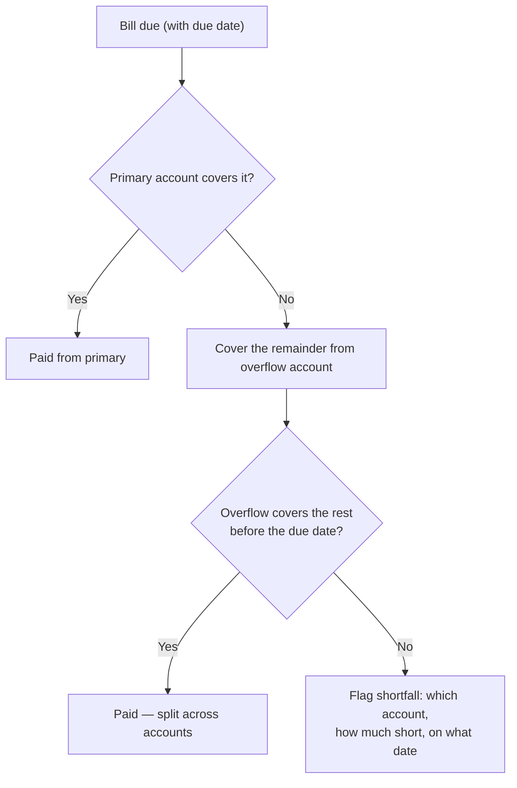

# Which Account Comes Up Short: Per-Account Solvency in Tally & Trace

A [previous post](/blog/tallyandtrace-update) rebuilt [Tally & Trace](/work/tallyandtrace)'s
forecaster into a day-ordered running-balance engine — one that could finally see the mid-month
trough where the bills come due before payday. It shipped with an honest limitation: it pooled
every account into a single balance. That's the right first answer to "am I solvent this month,"
and the wrong answer to the question that actually clears a payment: **can _this_ account cover
_this_ bill, on the day it's due?**

This update closes that gap, and brings a few other pieces of the spreadsheet across with it.

## Shipped

### Per-account solvency, with payment routing

The forecaster now projects a **running balance per account**, not one merged number. Each payable
is routed the way we actually pay it: from a **primary** account first, and only the overflow from
a designated second account. When the primary can't cover a bill, the engine draws the remainder
from overflow — and if that still isn't enough _before the due date_, it flags the shortfall with
the specific account, the amount short, and the date. "You're fine on paper but Card A is ₱X short
on the 24th" is a sentence the old pooled view structurally couldn't say.

### Credit-card statement modelling

Credit cards no longer show up as a single lump. The engine derives **one dated payable per
billing cycle** straight from the card's own transactions — walking each card's close day to its
due date — and routes that statement payment to its funding account like any other bill. This also
fixed a modelling bug: an unposted card charge used to leave cash on its _purchase_ date, as if you
paid at the register. A credit purchase doesn't touch cash until the statement is due, so the
forecast now defers the cash impact to the payment date, where it belongs.

### Also shipped

- **Installment "n of m" tracking** — recurring installments now carry their position in the plan
  ("Payment 3 of 12", "9 left"), so a financed purchase reads as progress toward payoff instead of
  an anonymous recurring line.
- **Auth & config hardening** — refresh tokens are now **rotating and revocable**, moved out of
  XSS-readable `localStorage` into **httpOnly cookies**. A production config guard refuses to boot
  with a placeholder `SECRET_KEY` or `DATABASE_URL`, and datetimes are timezone-aware end to end.
- **Multi-entity, for real** — co-members of a business entity now see each other's records, while
  personal data stays owner-only. The isolation model finally works both ways: shared where it
  should be shared, private where it must stay private.
- **A correctness baseline** — a growing pytest suite pins the money math: balances, transfers with
  fees, allocations, and FX round-tripping, all at full `Decimal` precision. The properties are
  blunt on purpose, because a finance tool that's _almost_ right isn't right.

## What's next

The forecaster can now tell you which account comes up short before payday. The next step is
letting you **ask it** — and act on what it says — without opening the app.

We're designing an **MCP connector** that lets you read your finances, and make guarded changes,
by talking to Claude: _"what bills are due before payday?"_, _"mark the electric bill paid."_
The plan is deliberately staged — **read-only tools first**, guarded writes second — everything
**entity-scoped** and gated behind **revocable personal-access tokens**, so access is narrow,
auditable, and easy to cut off. This is in design, not shipped; we'd rather get the guardrails
right than rush the writes.

## Why this matters

The throughline hasn't changed since day one: **exact money math, and solvency _before_ the bill
hits.** Every figure stays in `Decimal` from the database to the forecast — no floating-point drift
in numbers that decide whether rent clears. What this update adds is precision about _where_ the
money is: not just "will the month net out," but "will this specific account cover this specific
bill on the day it's due." That's the question a household actually asks at the end of the month —
and now it's the one the app answers first.
