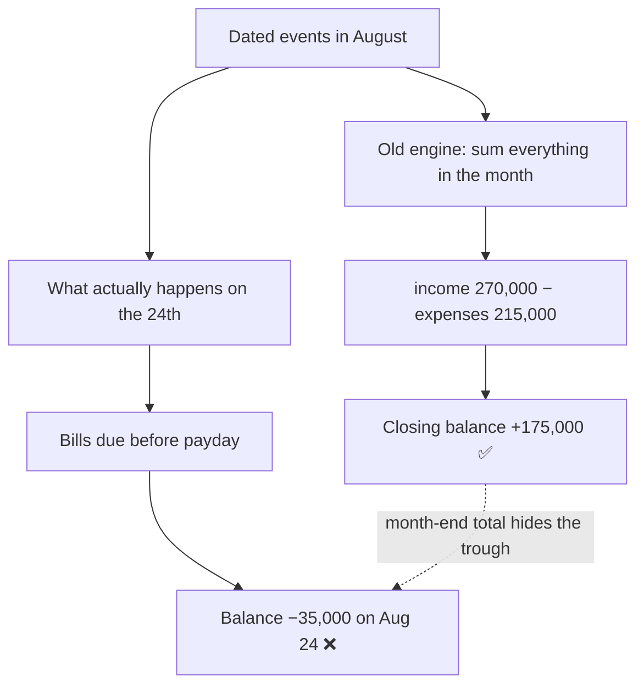
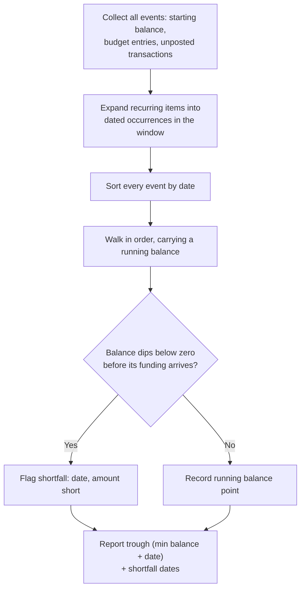

# The Month-End Total Lied: Modeling Cash-Flow Timing in Tally & Trace

## The whole point was to replace the spreadsheet

[Tally & Trace](/work/tallyandtrace) exists to retire our aging Google Sheet budget. So when we sat down to plan the next round of work, we did something we should have done much earlier: we put the real spreadsheet next to the app and mapped every section across, cell by cell.

Most of it mapped cleanly. Salaries and rent are recurring **budget entries**. The line items on each credit-card statement are **transactions** that sum to the card's balance. Installments ("bellroy 4:6") are budget entries with a fixed number of occurrences. Envelopes for cash and e-wallet spending are **allocations**. The app already had homes for all of it.

And then we got to the one number the spreadsheet exists to produce — and the app couldn't compute it at all.

## The number that keeps us solvent

Our income is lumpy. The bulk of it lands on the **last day of the month**. But the bills — rent, and a stack of credit-card statements — are due between roughly the **21st and the 27th**. Payday is _after_ the money is already spoken for.

So the single most important thing the spreadsheet does is a timing check: **take the starting balance, add only the income that arrives _before_ the due dates, and confirm it covers everything due before then.** If that check passes, we're fine. If it fails, we're overdrawn on the 24th no matter how healthy the month looks on paper — and we fall behind on payments, which for a household budget is the whole ballgame.

Here's a worked example. The numbers are illustrative, but the shape is exactly ours:

| Date   | Event               |   Amount | Running balance |
| ------ | ------------------- | -------: | --------------: |
| Aug 1  | Starting balance    |          |         120,000 |
| Aug 5  | Rent                |  −40,000 |          80,000 |
| Aug 14 | Biweekly payroll #1 |  +60,000 |         140,000 |
| Aug 22 | Credit card A       |  −80,000 |          60,000 |
| Aug 24 | Credit card B       |  −95,000 |     **−35,000** |
| Aug 28 | Biweekly payroll #2 |  +60,000 |          25,000 |
| Aug 30 | Month-end salary    | +150,000 |         175,000 |

Look at the last row: the month closes at **+175,000**. Comfortable. Now look at **August 24**: **−35,000**, days before payday. The month is healthy and you are insolvent on the 24th. Both are true. Only one of them matters for whether the payment clears.

## Why the app got it wrong

Tally & Trace already had a cash-flow forecaster. The problem was its resolution. It projected **month by month**: opening balance, sum the month's income, subtract the month's expenses, report the closing balance. That math produces the reassuring `+175,000` — and structurally cannot see the `−35,000`, because collapsing a month into a single net figure throws away the dates.



It was answering "will the month net out?" when the question that keeps us solvent is "will I be underwater at any point _within_ the month?" A budget app that replaces a spreadsheet has to answer the second one.

## The Build (Seth)

The rework turns the forecaster from a monthly-bucket engine into a **day-ordered running-balance** engine. Instead of netting a month, it walks every event in date order, carries a running balance, and reports two things the old version never could: the **lowest point the balance reaches (the trough) and the date it happens**, and a **shortfall alert** whenever cumulative payables outrun cumulative available funds before their due dates.



Two supporting changes fell out of the same spreadsheet audit:

- **Cadence that matches reality.** The old recurrence options were monthly, quarterly, semi-annual, annual. But our payroll is **biweekly** and our spending envelopes reset **twice a month** — neither was expressible. We added weekly, biweekly, and semi-monthly (the last with two configurable days, defaulting to the 1st and 15th) so the events land on the right dates in the first place. A projection is only as honest as its dates.
- **A liabilities fix.** While we were in there: the old "total balance" summed _every_ account, including credit cards. A credit-card balance is money you owe, not money you have — counting it as cash quietly inflated the picture. Now card balances are excluded from available cash; they show up as the payables they are, not as money on hand.

The nicest part is that this wasn't a rewrite. The data model already had due dates, billing-cycle fields, and per-entry accounts sitting unused. The rework was mostly about **reading fields the schema already had** and walking them in the right order.

## The Break (Christine)

A solvency alert you can't trust is worse than none — a false "you're fine" is exactly the failure we're trying to prevent. So this feature was built **test-backed**, and the properties under test are blunt on purpose:

- The running balance at any point equals the starting balance plus every dated event up to and including that point. No exceptions, no rounding drift — money math stays in `Decimal` end to end.
- The reported trough is genuinely the minimum over the whole window, and its date is correct.
- The worked example above is a fixture: given those events, the engine **must** flag August 24, and it **must not** be reassured by the +175,000 close.
- Biweekly and semi-monthly occurrences land on the correct calendar dates across month boundaries and leap years.

The old month-net path had no tests at all. The new one ships with the fixtures that make "the total lied" impossible to reintroduce.

## Verification

The engine's core is pure (no database), so its tests run anywhere; the worked example above is literally the headline fixture:

```bash
$ pytest app/tests/ -q                       # backend, against Postgres
16 passed

$ pnpm --filter @tally-trace/shared test     # the cadence math, in the shared package
10 passed
```

- **Worked-example fixture:** trough correctly reported at **Aug 24 / −35,000**, shortfall flagged, even though the month closes at **+175,000**. Reorder so income precedes the bills and the shortfall disappears — as it should.
- **Same-day tie-break:** when a bill and income land on the same day, outflows are applied first (the conservative assumption for solvency).
- **Cadence occurrences:** weekly, biweekly, and semi-monthly (default 1st & 15th, plus custom day pairs) verified across month boundaries, with day-of-month clamping (a "31st" becomes the 28th in February).
- **`Decimal` precision** held end to end — `0.10 + 0.20` is `0.30`, not `0.30000000000000004`.
- **Integration tests** hit the real endpoints against a seeded Postgres: `GET /forecast/timeline` excludes credit-card balances and returns chronologically-ordered running balances; posting a due entry creates the linked transaction, moves the account balance by the right amount, and advances the schedule.

This became the project's first real test baseline — CI now runs migrations and **gates on these tests** (backend pytest + the shared package's vitest) instead of letting them fail silently.

## Closing the loop

The timeline is the centerpiece, but a spreadsheet is more than one number — so the same pass finished the rest of the parity.

**Seeing it.** The engine feeds a dashboard hero card — a running-balance line with the trough marked and a red banner when there's a shortfall before payday — and a dedicated `/forecast` page with the full dated event table. The number we used to compute by hand is now the first thing you see on opening the app.


**Acting on it.** Seeing that a bill is due before payday is only half the job; you still have to pay it. So a due entry now has a **"Mark paid"** button that _materialises_ it — posts a real transaction against the account, moves the balance, and rolls the recurring schedule to its next date. The satisfying part: rather than re-implement how a transaction touches balances and budget envelopes, materialisation calls the _exact same code path_ as manually adding a transaction. One source of truth for money movement, so the two can't drift.

**The rest of the spreadsheet.** A **wishlist** with a priority-ordered "when can I afford each of these" plan derived from disposable income; **category and entity management**; and one-click **JSON/CSV export** of everything — because a budgeting tool you can't get your data out of is a trap, not a tool.

**A quiet engineering win.** Adding the new cadences surfaced a bug: the dashboard kept its _own_ copy of the recurrence math, and it didn't know about biweekly or semi-monthly, so it was silently under-counting them. Rather than maintain two drifting copies, we pulled the occurrence generator into the shared package as a single, tested function — and added the project's **first frontend tests** (vitest) to pin it down. Backend (Python) and frontend (TypeScript) still each need their own implementation, but the TypeScript side now has one home and a suite guarding it.

## Why this matters

The lesson here isn't really about cash flow. It's that **a summary can be perfectly correct and still answer the wrong question.** Our forecaster's month-end total was never _wrong_ — every peso of it was accurate. It just wasn't the number that decides whether rent clears. Replacing a spreadsheet doesn't mean reproducing its cells; it means reproducing the _judgment_ the person using it makes, and for us that judgment is a mid-month timing check, not a monthly sum.

It's also a small argument for auditing your own tool against the artifact it claims to replace. We'd been using Tally & Trace happily for months — while still quietly opening the spreadsheet at the end of every month to run the one check the app couldn't. That tell is the whole reason this post exists.

## What's next

A few threads open from here. The next correctness piece is **account-aware routing**: we pay a specific card from the payroll account at the _same bank_ first and only cover the overflow from checking, so the forecaster should model a per-payable funding source instead of pooling every account into one balance. **Upcoming-bill notifications** can fire on the lead time each entry already carries. And further out, the timeline is the foundation for the conversational layer we've been prototyping: once the app can answer "what's my lowest balance before payday, and what causes it," it can answer that out loud — through an assistant — without anyone opening a spreadsheet at all.
